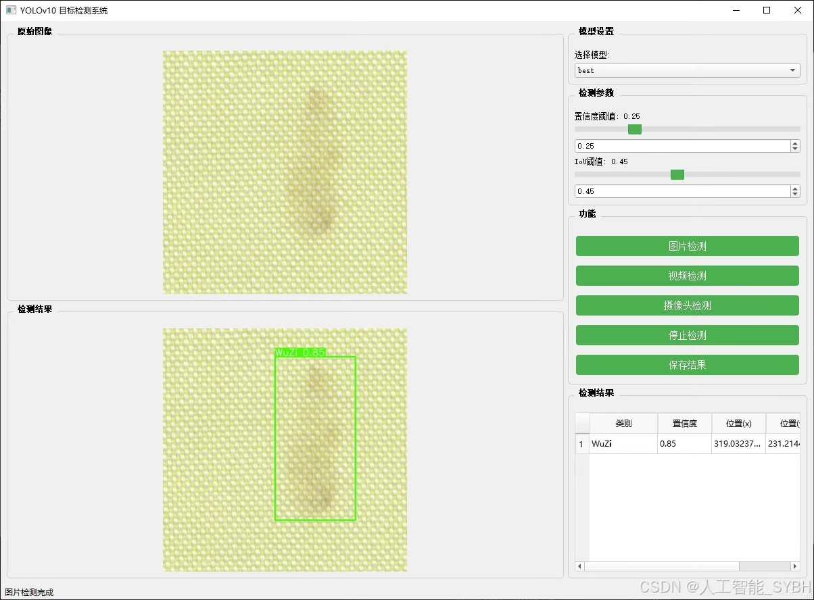
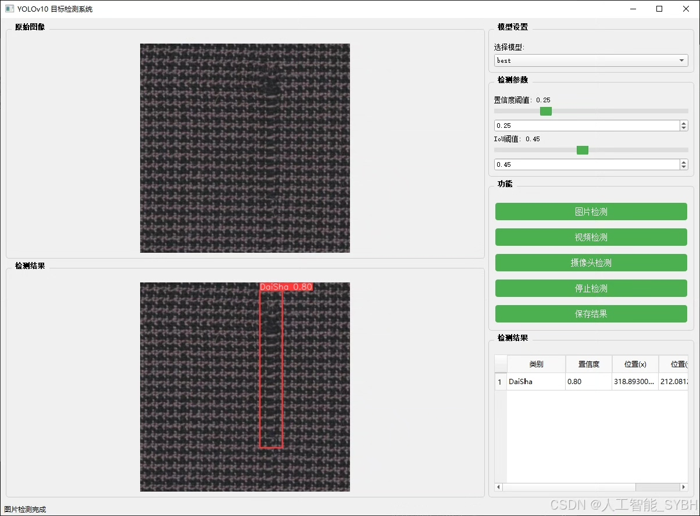
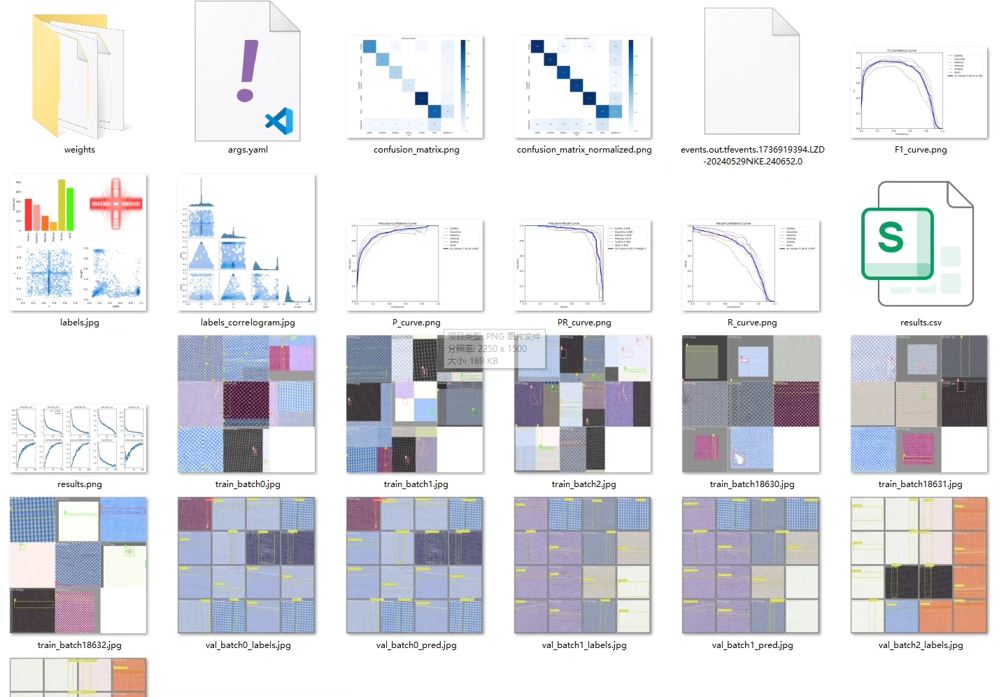
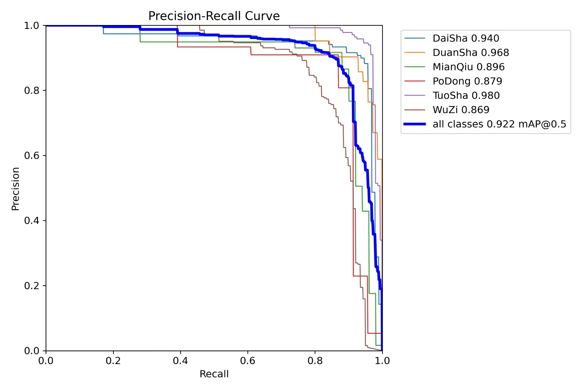
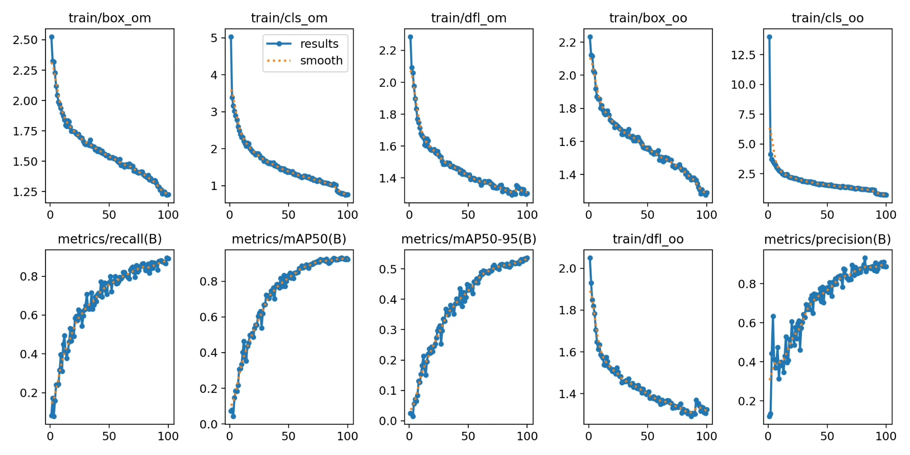
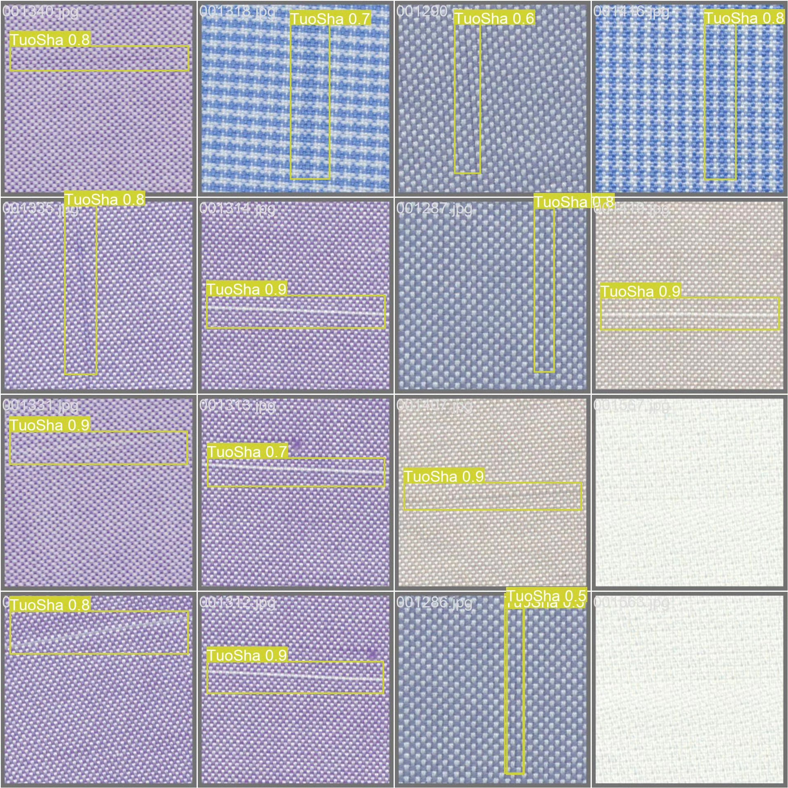
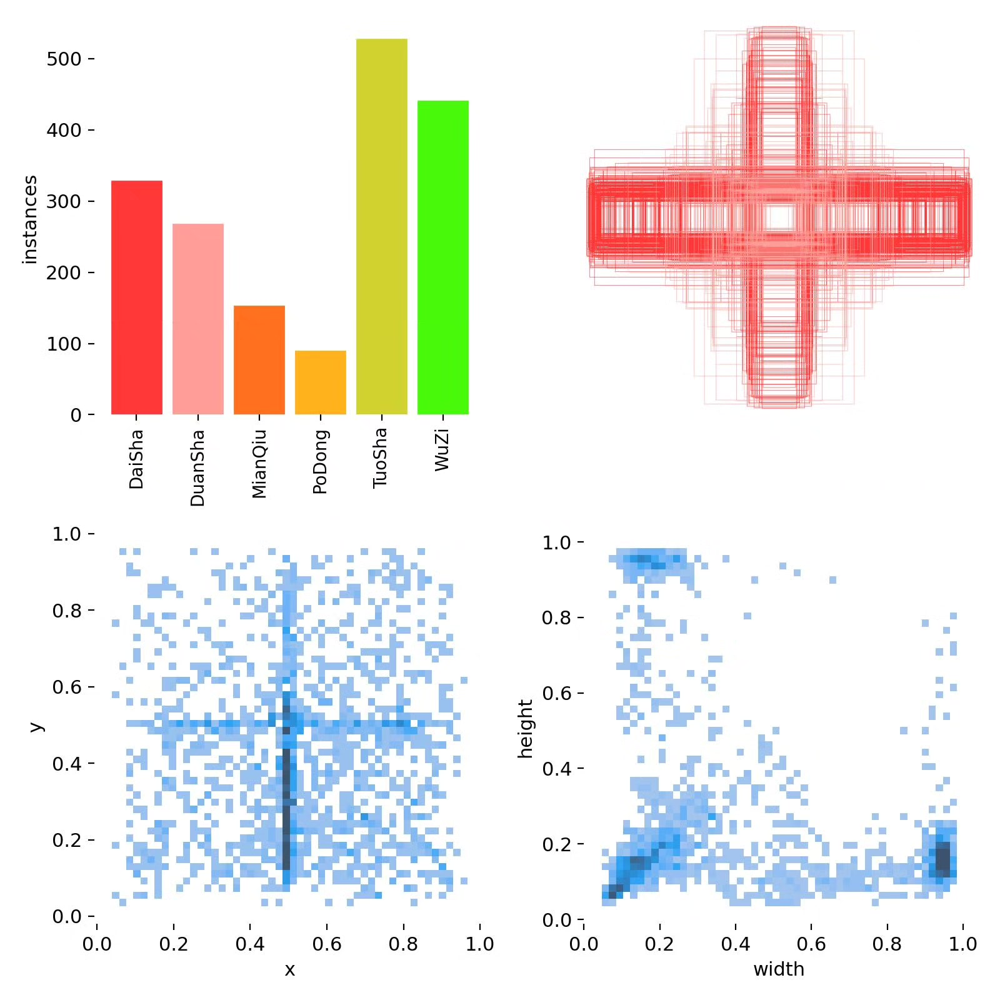
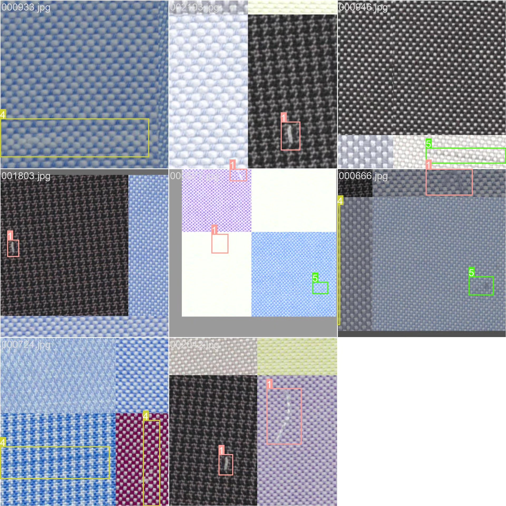

# Bandage Detection System Based on YOLOv10 Deep Learning

## Body

Based on the YOLOv10 deep learning, a cloth defect detection system (YOLOv10+YOLO dataset + UI interface + Python project source code + model)

In the textile industry, the quality inspection of cloth is an essential part of the production process. Traditional methods of cloth defect detection rely on manual inspection, which is inefficient and prone to errors. A cloth defect detection system based on computer vision and deep learning can automatically and efficiently identify various defects in cloth, thereby improving production efficiency and product quality. This project utilizes the YOLOv10 object detection algorithm to achieve automatic detection of six common cloth defects (threading, breakage, cotton ball, hole, dethreading, stain).

The company's products have obtained the official commercial license certification from YOLO.

We provide after-sales service.

After payment, we will provide WeChat ID for any questions you may have.

Environment configuration: We will provide a tutorial on how to configure the environment, and WeChat will provide answers to your questions.

Remote installation service: If you need remote configuration, an additional fee of 69 is required.
If the configuration fails, all fees will be refunded (specially for old computers only refund installation fees).

Retraining dataset: After configuring the environment, you can train on your own computer.
If you need us to retrain, just pay 69 plus computing power fees (2.5 yuan/hour).

Full after-sales service

## Images

## Payment

Here is a pay link on Stripe ( https://buy.stripe.com/3cs8yP7sY87d0vu9AB ). Please contact me lonlonago@foxmail.com after funding $89, and I will send you a complete data files , thank you!

